# Sequence Diagram Patterns

## API Communication Patterns

### 1. REST API Request-Response

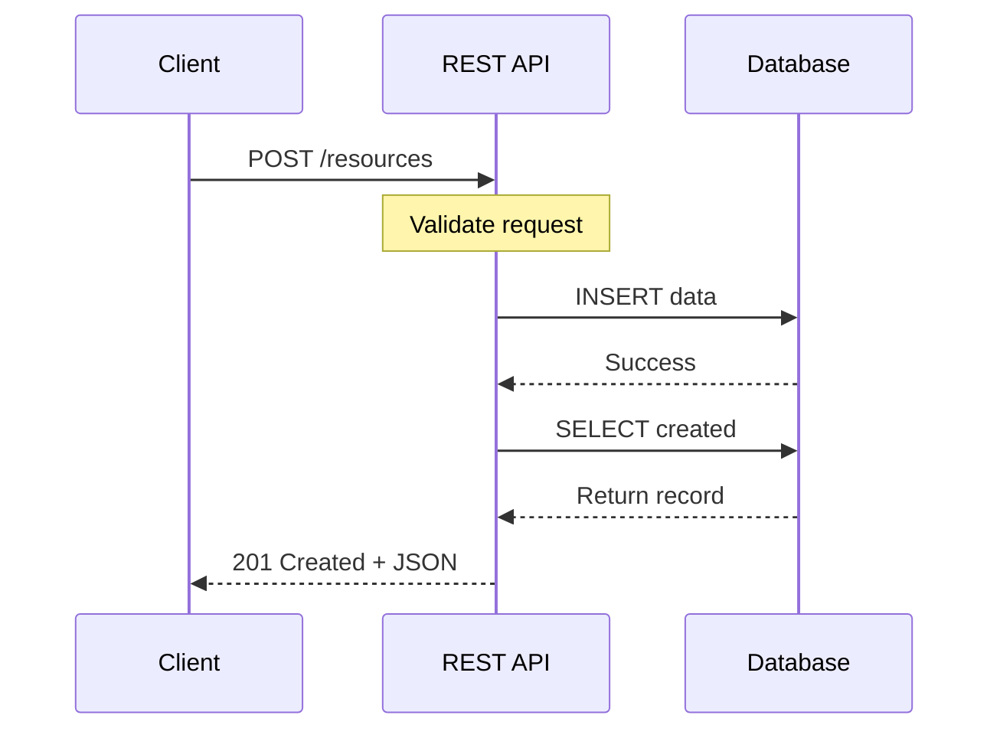
```mermaid
sequenceDiagram
    participant C as Client
    participant API as REST API
    participant DB as Database

    C->>API: POST /resources
    Note over API: Validate request
    API->>DB: INSERT data
    DB-->>API: Success
    API->>DB: SELECT created
    DB-->>API: Return record
    API-->>C: 201 Created + JSON
```

### 2. Paginated List Request

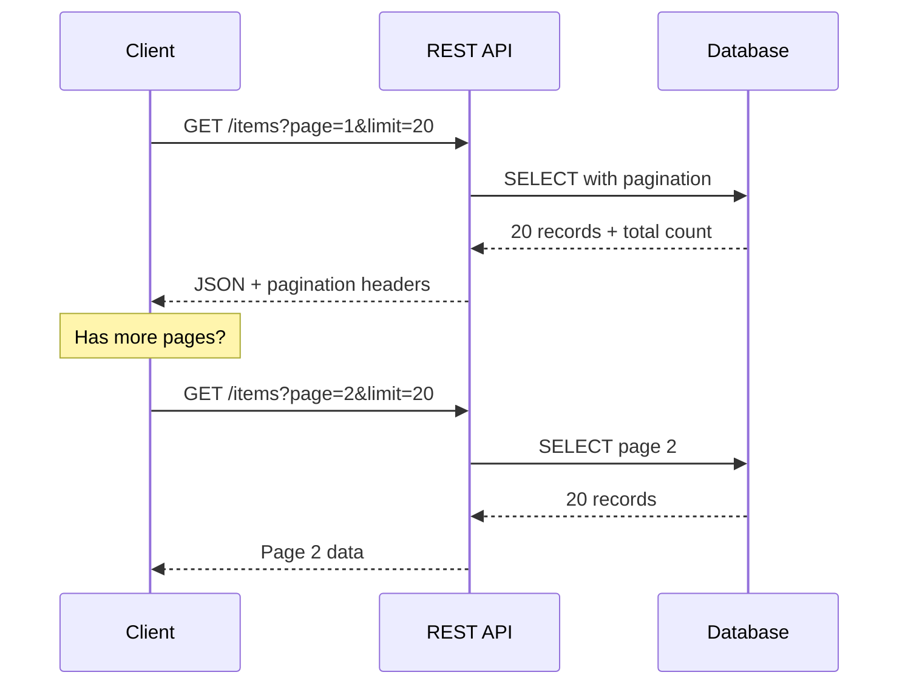
```mermaid
sequenceDiagram
    participant C as Client
    participant API as REST API
    participant DB as Database

    C->>API: GET /items?page=1&limit=20
    API->>DB: SELECT with pagination
    DB-->>API: 20 records + total count
    API-->>C: JSON + pagination headers
    Note over C: Has more pages?
    C->>API: GET /items?page=2&limit=20
    API->>DB: SELECT page 2
    DB-->>API: 20 records
    API-->>C: Page 2 data
```

### 3. Authentication Flow

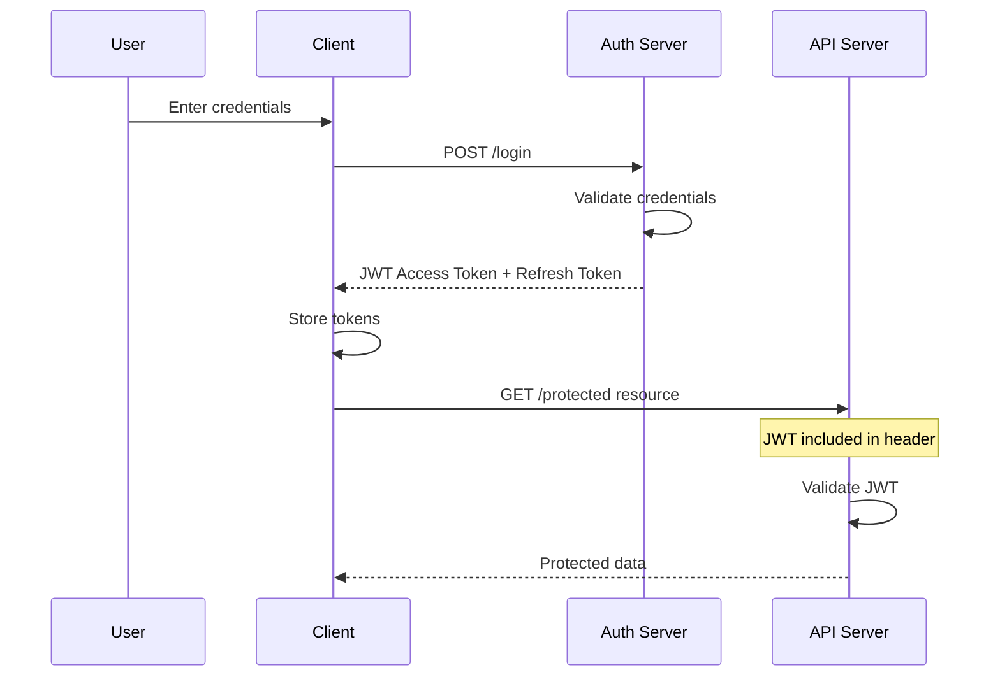
```mermaid
sequenceDiagram
    participant U as User
    participant C as Client
    participant A as Auth Server
    participant API as API Server

    U->>C: Enter credentials
    C->>A: POST /login
    A->>A: Validate credentials
    A-->>C: JWT Access Token + Refresh Token
    C->>C: Store tokens
    C->>API: GET /protected resource
    Note over API: JWT included in header
    API->>API: Validate JWT
    API-->>C: Protected data
```

### 4. Token Refresh Flow

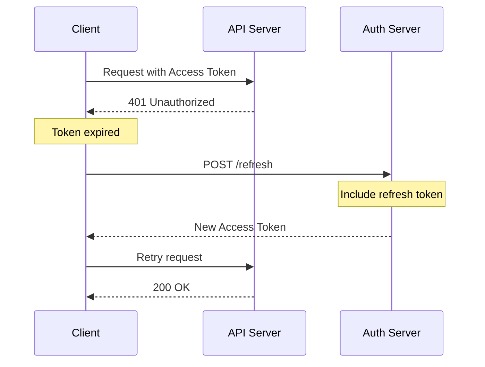
```mermaid
sequenceDiagram
    participant C as Client
    participant API as API Server
    participant A as Auth Server

    C->>API: Request with Access Token
    API-->>C: 401 Unauthorized
    Note over C: Token expired
    C->>A: POST /refresh
    Note over A: Include refresh token
    A-->>C: New Access Token
    C->>API: Retry request
    API-->>C: 200 OK
```

## Real-time Communication Patterns

### 1. WebSocket Connection

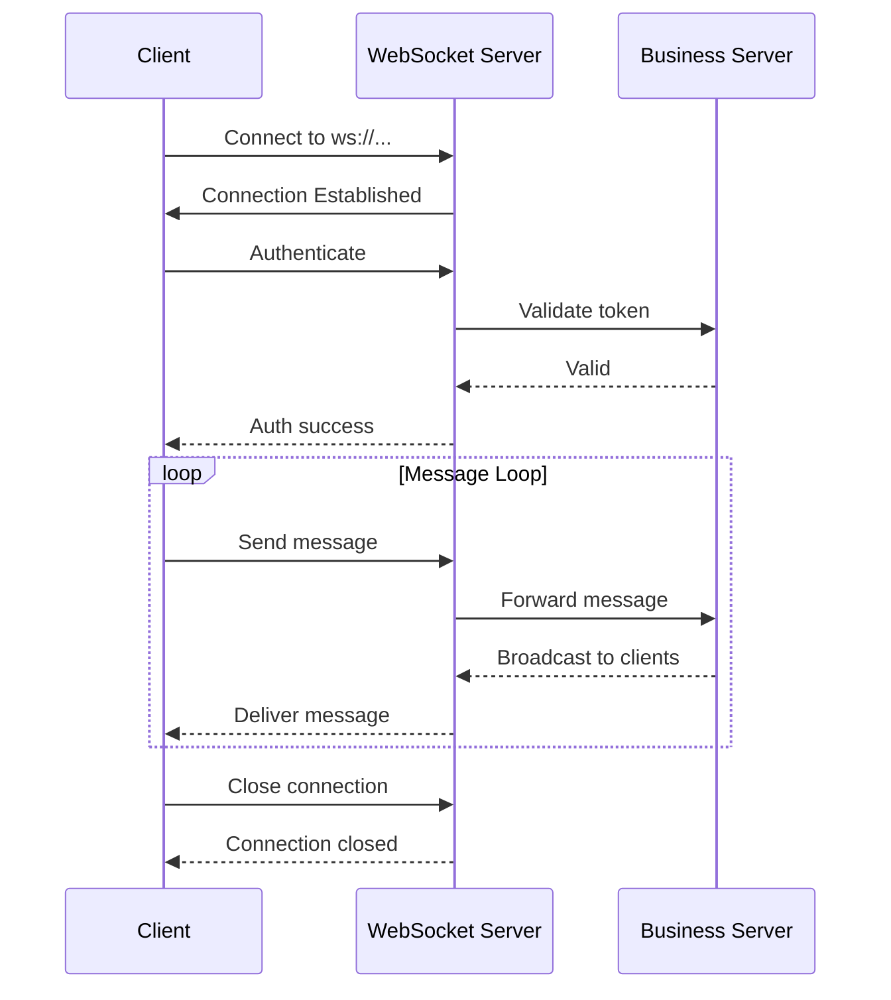
```mermaid
sequenceDiagram
    participant C as Client
    participant WS as WebSocket Server
    participant S as Business Server

    C->>WS: Connect to ws://...
    WS->>C: Connection Established
    C->>WS: Authenticate
    WS->>S: Validate token
    S-->>WS: Valid
    WS-->>C: Auth success
    loop Message Loop
        C->>WS: Send message
        WS->>S: Forward message
        S-->>WS: Broadcast to clients
        WS-->>C: Deliver message
    end
    C->>WS: Close connection
    WS-->>C: Connection closed
```

### 2. Server-Sent Events (SSE)

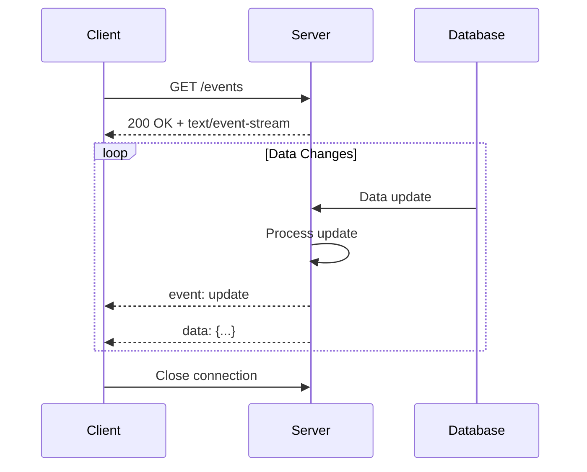
```mermaid
sequenceDiagram
    participant C as Client
    participant S as Server
    participant DB as Database

    C->>S: GET /events
    S-->>C: 200 OK + text/event-stream
    loop Data Changes
        DB->>S: Data update
        S->>S: Process update
        S-->>C: event: update
        S-->>C: data: {...}
    end
    C->>S: Close connection
```

### 3. Push Notification Flow

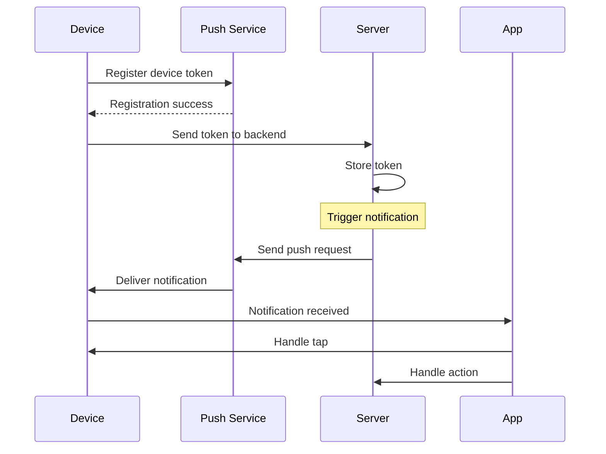
```mermaid
sequenceDiagram
    participant D as Device
    participant P as Push Service
    participant S as Server
    participant A as App

    D->>P: Register device token
    P-->>D: Registration success
    D->>S: Send token to backend
    S->>S: Store token
    Note over S: Trigger notification
    S->>P: Send push request
    P->>D: Deliver notification
    D->>A: Notification received
    A->>D: Handle tap
    A->>S: Handle action
```

## IoT Device Patterns

### 1. Device Provisioning

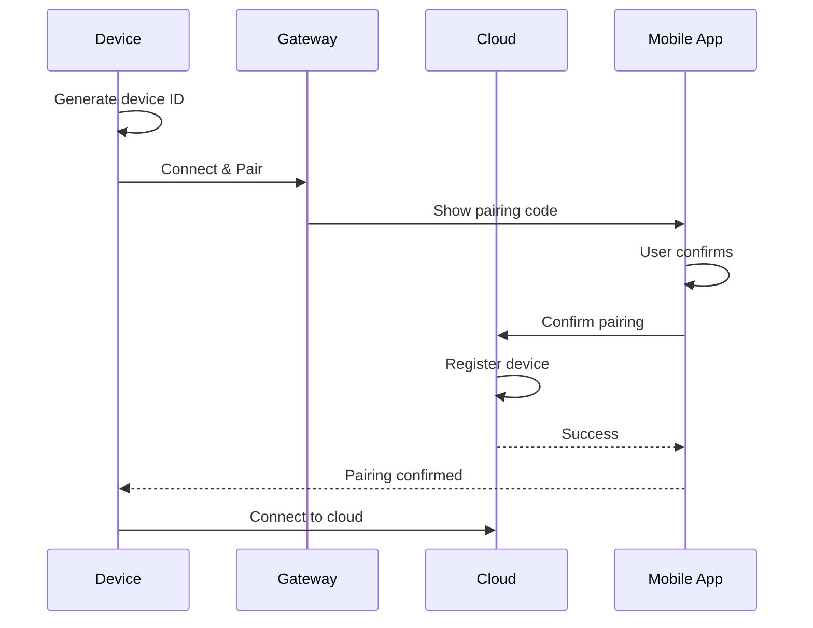
```mermaid
sequenceDiagram
    participant D as Device
    participant GW as Gateway
    participant C as Cloud
    participant A as Mobile App

    D->>D: Generate device ID
    D->>GW: Connect & Pair
    GW->>A: Show pairing code
    A->>A: User confirms
    A->>C: Confirm pairing
    C->>C: Register device
    C-->>A: Success
    A-->>D: Pairing confirmed
    D->>C: Connect to cloud
```

### 2. OTA Firmware Update

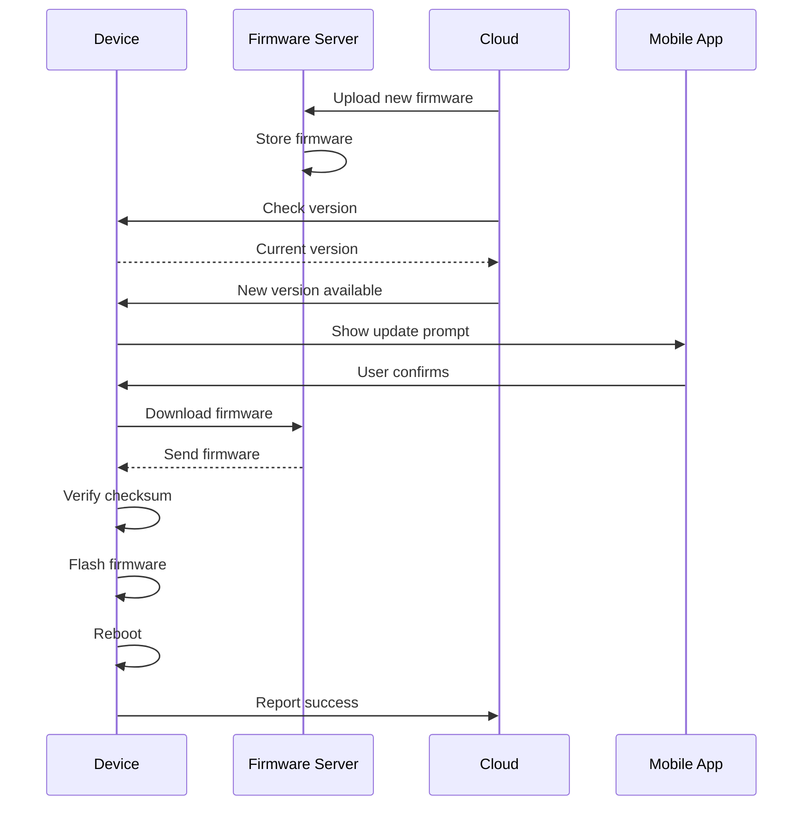
```mermaid
sequenceDiagram
    participant D as Device
    participant F as Firmware Server
    participant C as Cloud
    participant A as Mobile App

    C->>F: Upload new firmware
    F->>F: Store firmware
    C->>D: Check version
    D-->>C: Current version
    C->>D: New version available
    D->>A: Show update prompt
    A->>D: User confirms
    D->>F: Download firmware
    F-->>D: Send firmware
    D->>D: Verify checksum
    D->>D: Flash firmware
    D->>D: Reboot
    D->>C: Report success
```

### 3. Sensor Data Collection

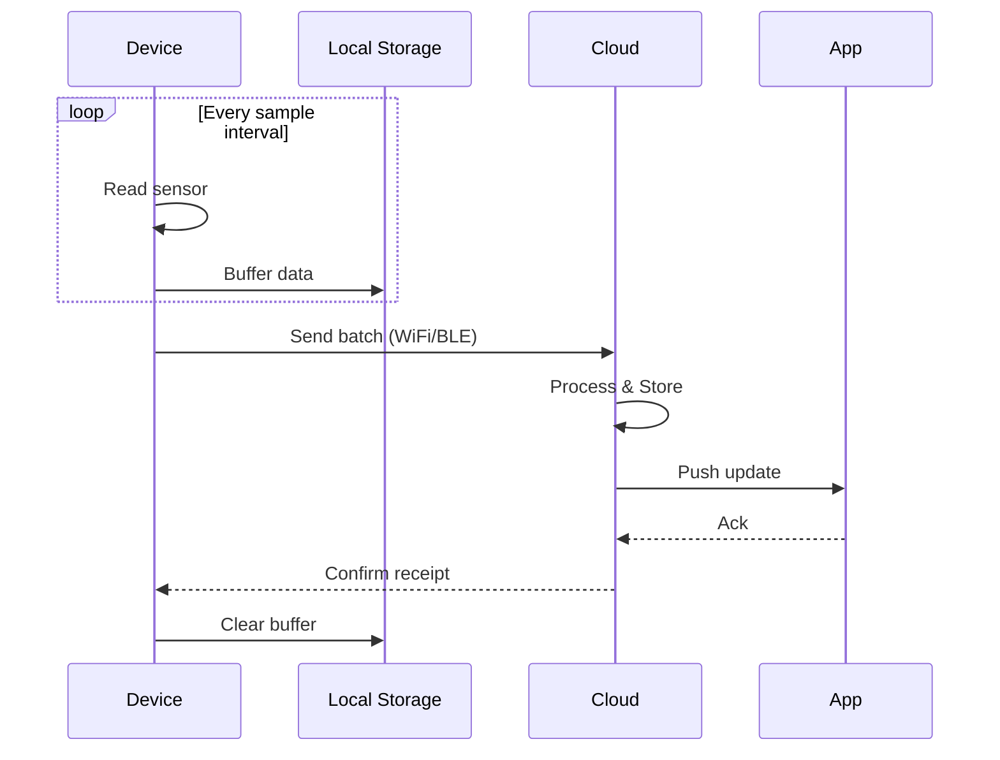
```mermaid
sequenceDiagram
    participant D as Device
    participant L as Local Storage
    participant C as Cloud
    participant A as App

    loop Every sample interval
        D->>D: Read sensor
        D->>L: Buffer data
    end
    D->>C: Send batch (WiFi/BLE)
    C->>C: Process & Store
    C->>A: Push update
    A-->>C: Ack
    C-->>D: Confirm receipt
    D->>L: Clear buffer
```

## Data Synchronization Patterns

### 1. Bidirectional Sync

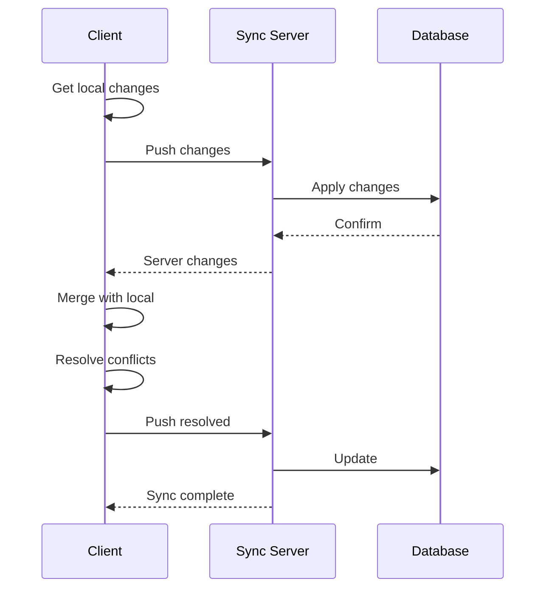
```mermaid
sequenceDiagram
    participant C as Client
    participant S as Sync Server
    participant DB as Database

    C->>C: Get local changes
    C->>S: Push changes
    S->>DB: Apply changes
    DB-->>S: Confirm
    S-->>C: Server changes
    C->>C: Merge with local
    C->>C: Resolve conflicts
    C->>S: Push resolved
    S->>DB: Update
    S-->>C: Sync complete
```

### 2. Offline-First Sync

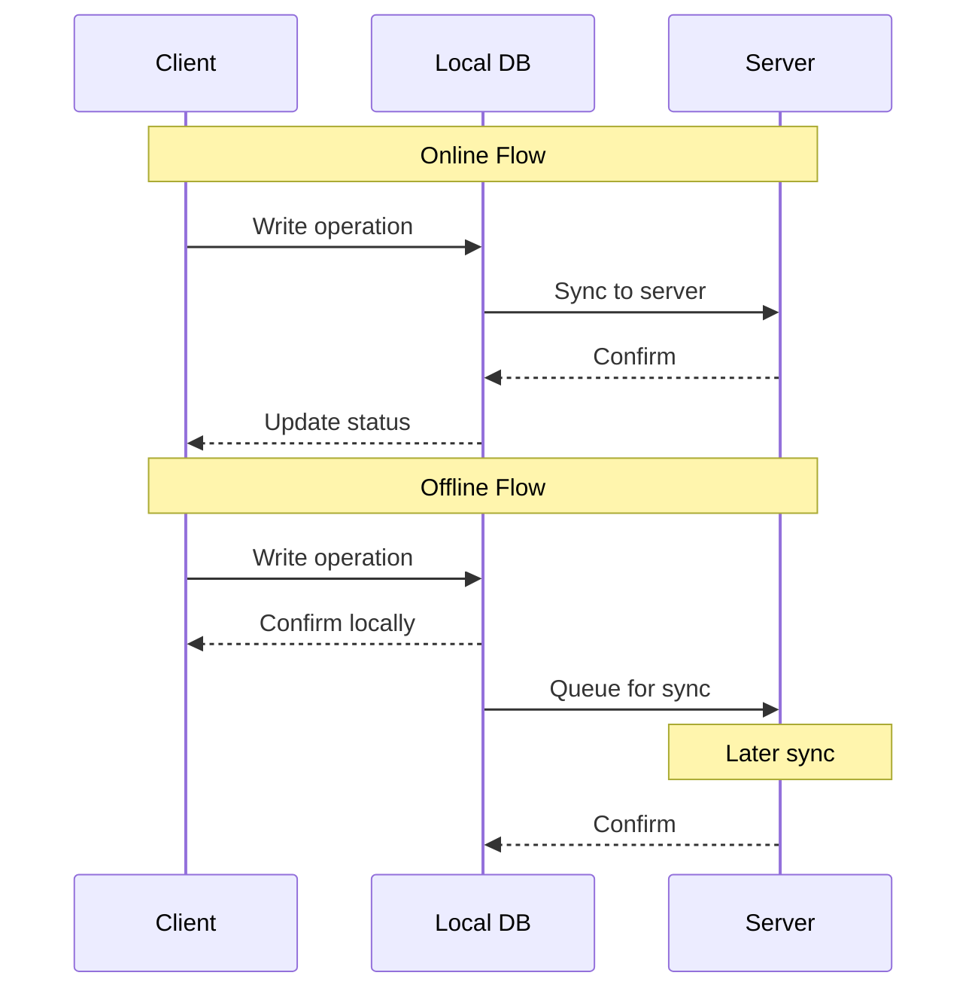
```mermaid
sequenceDiagram
    participant C as Client
    participant L as Local DB
    participant S as Server

    Note over C,S: Online Flow
    C->>L: Write operation
    L->>S: Sync to server
    S-->>L: Confirm
    L-->>C: Update status

    Note over C,S: Offline Flow
    C->>L: Write operation
    L-->>C: Confirm locally
    L->>S: Queue for sync
    Note over S: Later sync
    S-->>L: Confirm
```

### 3. Conflict Resolution

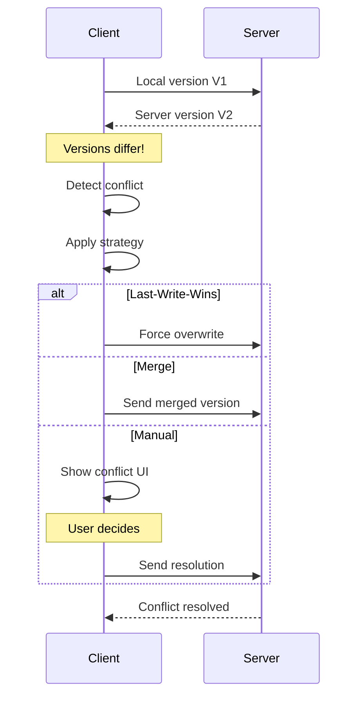
```mermaid
sequenceDiagram
    participant C as Client
    participant S as Server

    C->>S: Local version V1
    S-->>C: Server version V2
    Note over C: Versions differ!
    C->>C: Detect conflict
    C->>C: Apply strategy
    alt Last-Write-Wins
        C->>S: Force overwrite
    else Merge
        C->>S: Send merged version
    else Manual
        C->>C: Show conflict UI
        Note over C: User decides
        C->>S: Send resolution
    end
    S-->>C: Conflict resolved
```

## Background Processing Patterns

### 1. Background Task

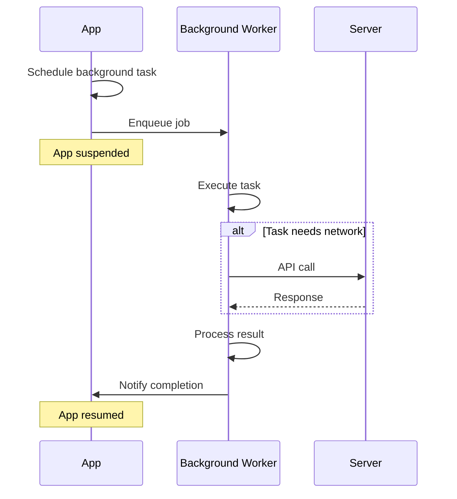
```mermaid
sequenceDiagram
    participant A as App
    participant B as Background Worker
    participant S as Server

    A->>A: Schedule background task
    A->>B: Enqueue job
    Note over A: App suspended
    B->>B: Execute task
    alt Task needs network
        B->>S: API call
        S-->>B: Response
    end
    B->>B: Process result
    B->>A: Notify completion
    Note over A: App resumed
```

### 2. WorkManager/Job Scheduler

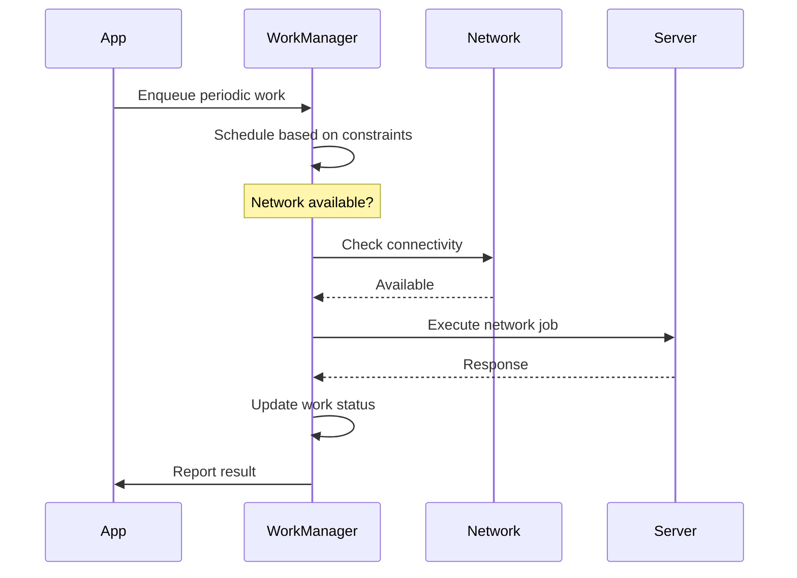
```mermaid
sequenceDiagram
    participant A as App
    participant W as WorkManager
    participant N as Network
    participant S as Server

    A->>W: Enqueue periodic work
    W->>W: Schedule based on constraints
    Note over W: Network available?
    W->>N: Check connectivity
    N-->>W: Available
    W->>S: Execute network job
    S-->>W: Response
    W->>W: Update work status
    W->>A: Report result
```
